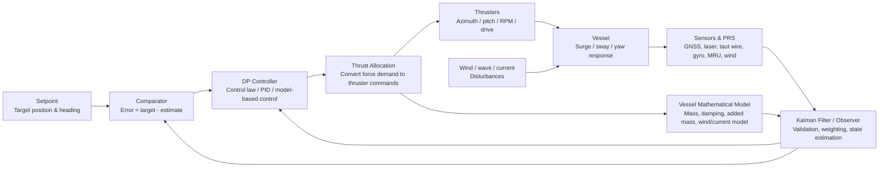
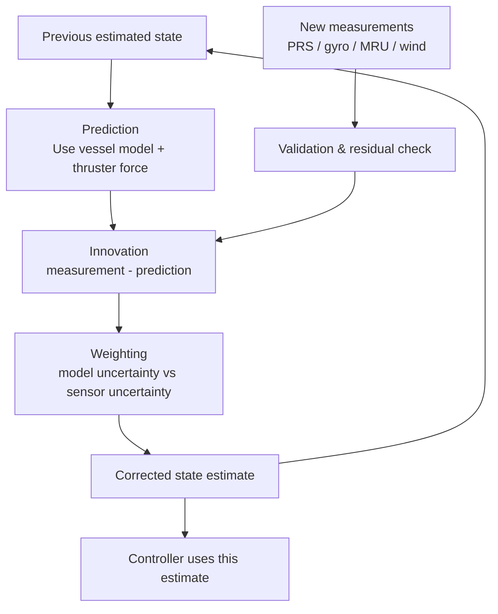

# Closed-loop Control

## Why This Page Matters

Closed-loop Control은 DP Controller의 핵심 구조다.
Closed-loop control is the core structure of the DP controller.

DP는 “추력 명령을 한 번 내고 끝나는 시스템”이 아니라, 선박의 실제 위치와 heading을 계속 추정하고 목표값과 비교한 뒤 오차를 줄이도록 추력을 반복해서 수정하는 시스템이다.
DP is not a system that sends one thrust command and stops; it repeatedly estimates actual vessel position and heading, compares them with the target, and updates thrust to reduce the error.

이 고리 안에서 [[Vessel Mathematical Model]]은 “선박이 어떻게 움직일지 예측하는 내부 선박”이고, [[Kalman Filter]]는 “센서와 모델을 섞어서 가장 믿을 만한 현재 상태를 만드는 추정기”다.
Inside this loop, the [[Vessel Mathematical Model]] is the “internal vessel” used to predict motion, and the [[Kalman Filter]] is the estimator that combines sensors and model prediction into the best available vessel state.

## Big Picture



## What Is Actually Closing the Loop?

The loop is closed by feedback.
루프는 feedback으로 닫힌다.

The DP system does not control the vessel from raw GNSS alone.
DP 시스템은 GNSS 원자료만으로 선박을 제어하지 않는다.

It controls the vessel using an estimated state.
추정된 상태값을 이용해 선박을 제어한다.

The estimated state normally includes position, velocity, heading, yaw rate, and sometimes slowly varying environmental force.
추정 상태에는 보통 위치, 속도, heading, yaw rate, 그리고 때로는 느리게 변하는 환경 외력이 포함된다.

```text
Target state
  - estimated vessel state
  = control error

Control error
  -> controller demand
  -> required surge/sway/yaw force
  -> thruster commands
  -> vessel motion
  -> new measurements
  -> updated estimate
  -> new control error
```

## Where the Mathematical Model Acts

[[Vessel Mathematical Model]]은 sensor 뒤쪽에만 있는 것이 아니라 loop 전체에 걸쳐 작용한다.
The [[Vessel Mathematical Model]] does not sit only behind the sensors; it acts across the whole loop.

| Location | Korean | English |
|---|---|---|
| Prediction | 이전 상태와 thruster force로 다음 선박 상태를 예측한다. | Predicts the next vessel state from previous state and thruster force. |
| Filtering | 센서값이 noisy할 때 “물리적으로 그럴듯한 움직임”을 판단한다. | Judges physically plausible motion when measurements are noisy. |
| Current / disturbance estimation | wind feed-forward 이후 남는 저주파 외력을 추정한다. | Estimates low-frequency residual disturbance after wind feed-forward. |
| Controller tuning | 선체 관성, damping, 응답 속도에 맞춰 제어 gain과 응답을 잡는다. | Supports gains and response matched to inertia, damping, and vessel response. |
| PRS drop-out | 짧은 PRS 상실 동안 제한적인 dead reckoning을 제공한다. | Provides limited dead reckoning during short PRS loss. |

쉽게 말하면, 모델은 DP 컴퓨터 안에 있는 “가상의 선박”이다.
Simply put, the model is a “virtual vessel” inside the DP computer.

센서가 흔들리면 모델은 “선박이 실제로 그렇게 순간이동할 수 있는가?”를 따져준다.
When sensors jump, the model helps ask: “Could the vessel physically move like that?”

하지만 모델은 현실 그 자체가 아니다.
But the model is not reality itself.

Draft, loading condition, shallow water, thruster degradation, hull fouling, nearby structures, current profile, and wave condition can make the real vessel differ from the model.
Draft, loading condition, shallow water, thruster degradation, hull fouling, nearby structures, current profile, and wave condition can make the real vessel differ from the model.

## Where the Kalman Filter Acts

[[Kalman Filter]]는 PRS와 gyro 값을 보기 좋게 평균내는 장치가 아니다.
The [[Kalman Filter]] is not just a device for making a pretty average of PRS and gyro values.

It is the estimator that decides how much to trust the model prediction and how much to trust each measurement.
모델 예측을 얼마나 믿고 각 측정값을 얼마나 믿을지 결정하는 추정기다.



The Kalman filter is therefore between measurement and control.
따라서 Kalman filter는 measurement와 control 사이에 있다.

If this estimate is wrong, the controller can make a logically correct command based on a wrong picture of reality.
이 추정값이 틀리면 controller는 잘못된 현실 인식에 기반해 논리적으로는 맞지만 실제로는 위험한 명령을 만들 수 있다.

## Controller, Observer and Allocation

DP loop를 세 덩어리로 보면 이해가 쉽다.
The DP loop is easier to understand as three blocks.

| Block | Korean | English |
|---|---|---|
| Observer / Estimator | 센서와 모델로 현재 선박 상태를 추정한다. | Estimates the current vessel state using sensors and model. |
| Controller | 목표와 추정값의 오차를 보고 필요한 force/moment를 계산한다. | Calculates required force/moment from target-estimate error. |
| Thrust Allocation | 필요한 force/moment를 각 thruster 명령으로 나눈다. | Distributes required force/moment into individual thruster commands. |

Observer가 틀리면 controller는 잘못된 오차를 본다.
If the observer is wrong, the controller sees the wrong error.

Controller tuning이 나쁘면 추정값은 맞아도 oscillation, overshoot, slow recovery가 생긴다.
If controller tuning is poor, oscillation, overshoot, or slow recovery can occur even with a good estimate.

Thrust allocation이 물리 한계를 넘으면 controller가 아무리 좋은 명령을 만들어도 vessel은 따라오지 못한다.
If thrust allocation exceeds physical capability, the vessel cannot follow even a good controller demand.

## Feedback and Feed-forward

DP는 feedback만 쓰지 않는다.
DP does not use feedback only.

Wind sensor and vessel wind coefficients can be used for feed-forward.
Wind sensor와 선박 wind coefficient는 feed-forward에 사용될 수 있다.

Feed-forward는 오차가 생기기 전에 예상 외력을 먼저 보상한다.
Feed-forward compensates expected disturbance before the error appears.

Feedback은 이미 남아 있는 오차를 보고 수정한다.
Feedback corrects the remaining error after it appears.

```text
Wind measured
  -> expected wind force
  -> feed-forward thrust demand

Residual position/heading error
  -> feedback thrust demand

Total demand
  -> thrust allocation
```

Wind feed-forward가 정확하면 thruster가 미리 바람을 받쳐주므로 위치오차가 작아진다.
If wind feed-forward is accurate, the thrusters support the wind load early and position error becomes smaller.

Feed-forward가 틀려도 feedback loop가 남은 오차를 보정한다.
Even if feed-forward is imperfect, the feedback loop corrects the remaining error.

## Low-frequency and Wave-frequency Motion

DP controller가 모든 움직임을 똑같이 따라가면 안 된다.
The DP controller must not chase every motion in the same way.

Wave-frequency motion is fast oscillatory motion caused by waves.
Wave-frequency motion은 파랑 때문에 생기는 빠른 진동 운동이다.

Low-frequency motion is the slower drift that DP must control.
Low-frequency motion은 DP가 제어해야 하는 느린 drift다.

Kalman filtering and observer design help separate these.
Kalman filtering과 observer design은 둘을 분리하는 데 도움을 준다.

If the system chases wave-frequency motion, thrusters hunt and waste power.
시스템이 wave-frequency motion을 따라가면 thruster hunting과 전력 낭비가 생긴다.

If filtering is too slow, the vessel reacts late to real drift.
Filtering이 너무 느리면 실제 drift에 늦게 반응한다.

This is why DP control is not just “keep position”; it is “keep position without chasing noise and waves.”
그래서 DP 제어는 단순히 “위치 유지”가 아니라 “noise와 wave를 쫓지 않으면서 위치 유지”다.

## Failure Modes in the Closed Loop

### PRS Jump

If a PRS suddenly jumps, the estimator must decide whether the vessel moved or the measurement is wrong.
PRS가 갑자기 튀면 estimator는 선박이 움직인 것인지 측정값이 틀린 것인지 판단해야 한다.

Bad validation can create a false error and a dangerous corrective thrust.
검증이 나쁘면 가짜 오차와 위험한 복원 추력이 만들어질 수 있다.

### Model Drift

If PRS is lost for too long, model prediction uncertainty grows.
PRS가 너무 오래 사라지면 모델 예측의 불확실성이 커진다.

Dead reckoning is useful for short gaps, but it is not a substitute for position reference.
Dead reckoning은 짧은 공백에는 유용하지만 position reference의 대체물이 아니다.

### Wrong Sign or Coordinate Frame

If heading reference, sensor alignment, or thruster sign is wrong, negative feedback can become positive feedback.
Heading reference, sensor alignment, thruster sign이 틀리면 negative feedback이 positive feedback처럼 될 수 있다.

The vessel may then move further away while the controller believes it is correcting.
그 경우 controller는 보정한다고 생각하지만 선박은 더 멀어질 수 있다.

### Thruster Saturation

If required force exceeds available thrust, closed-loop control cannot overcome physics.
필요 force가 가용 추력을 넘으면 closed-loop control은 물리 한계를 이길 수 없다.

The controller will demand more, but the vessel will still drift.
Controller는 더 요구하지만 선박은 계속 밀릴 수 있다.

### Bad Weighting

If a poor-quality PRS is weighted too strongly, the estimate follows bad data.
품질 낮은 PRS에 너무 큰 weight가 주어지면 추정값이 나쁜 데이터를 따라간다.

If a good PRS is rejected too easily, the system may rely too much on model prediction.
좋은 PRS가 너무 쉽게 reject되면 시스템은 모델 예측에 과도하게 의존할 수 있다.

## DPO Interpretation

DPO가 봐야 할 흐름은 다음이다.
The DPO should read the following chain.

```text
Sensor / PRS quality
→ estimated vessel position and heading
→ controller demand
→ allocated thruster command
→ actual thruster feedback
→ vessel response
→ new estimate
```

Position error만 보는 것은 늦다.
Looking only at position error is late.

Controller demand가 증가하는데 thruster feedback이 따라오지 않는지 봐야 한다.
The DPO should check whether actual thruster feedback follows increasing controller demand.

Thruster는 정상인데 estimate가 흔들리는지 봐야 한다.
The DPO should check whether the estimate is unstable while thrusters are normal.

PRS 하나를 넣거나 뺐을 때 estimate와 demand가 급변하는지 봐야 한다.
The DPO should check whether estimate and demand change abruptly when one PRS is added or removed.

## Key References

- Thor I. Fossen, *Guidance and Control of Ocean Vehicles*, 1994.
- Thor I. Fossen, *Handbook of Marine Craft Hydrodynamics and Motion Control*, 2nd ed., 2021.
- T. I. Fossen and J. P. Strand, “Passive nonlinear observer design for ships using Lyapunov methods: full-scale experiments with a supply vessel,” *Automatica*, 1999.
- T. I. Fossen and T. Perez, “Kalman filtering for positioning and heading control of ships and offshore rigs,” IEEE Control Systems Magazine, 2009.
- A. J. Sørensen, “A survey of dynamic positioning control systems,” *Annual Reviews in Control*, 2011.

## Related Notes

- [[DP Controller]]
- [[PID Control]]
- [[Kalman Filter]]
- [[Vessel Mathematical Model]]
- [[Thrust Allocation]]
- [[Position Reference Systems]]
