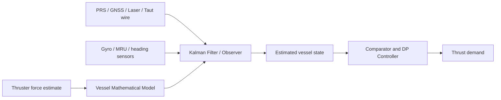
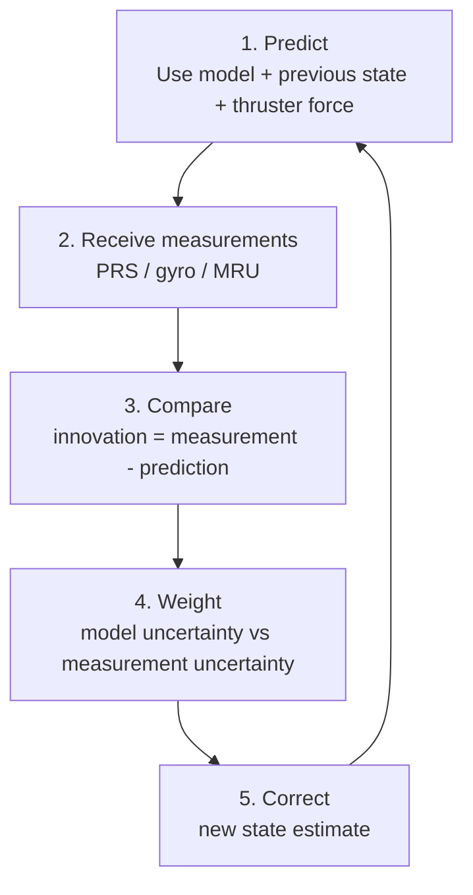

# Kalman Filter

## Definition

Kalman Filter는 noisy한 센서값과 [[Vessel Mathematical Model]]의 예측을 결합해 선박의 가장 그럴듯한 현재 상태를 추정하는 알고리즘이다.
The Kalman filter is an algorithm that combines noisy sensor measurements with [[Vessel Mathematical Model]] prediction to estimate the most likely current vessel state.

DP에서는 position, velocity, heading, yaw rate, 그리고 느리게 변하는 environmental force를 추정하는 데 사용된다.
In DP, it is used to estimate position, velocity, heading, yaw rate, and slowly varying environmental force.

핵심은 “측정값을 믿을까, 모델을 믿을까?”를 매 순간 계산하는 것이다.
The key question is: “Should the system trust the measurement or the model more at this moment?”

## Where It Sits

Kalman Filter는 sensor와 controller 사이에 있다.
The Kalman filter sits between sensors and the controller.

Controller가 보는 위치는 보통 raw PRS가 아니라 filter가 만든 estimated position이다.
The position seen by the controller is normally not raw PRS, but the estimated position produced by the filter.

## Predict-Correct Cycle

### 1. Predict

The filter uses the vessel model to predict where the vessel should be.
Filter는 선박 모델을 이용해 선박이 어디에 있어야 하는지 예측한다.

This prediction uses previous position, velocity, heading, yaw rate, and estimated thrust/disturbance.
이 예측은 이전 위치, 속도, heading, yaw rate, 추정된 추력/외력을 사용한다.

### 2. Measure

The system receives new measurements from PRS, gyro, MRU, and other sensors.
시스템은 PRS, gyro, MRU 및 다른 센서에서 새 측정값을 받는다.

These measurements contain noise, bias, delay, and sometimes jumps.
이 측정값에는 noise, bias, delay, jump가 포함될 수 있다.

### 3. Compare

The difference between prediction and measurement is called innovation or residual.
예측과 측정의 차이를 innovation 또는 residual이라고 한다.

Large residual may mean real vessel motion, sensor error, wrong model, or a changing environment.
Residual이 크다는 것은 실제 선박 운동, 센서 오류, 잘못된 모델, 또는 변하는 환경을 의미할 수 있다.

### 4. Weight

The filter gives weight according to uncertainty.
Filter는 불확실성에 따라 weight를 준다.

High-quality measurement gets more weight.
품질 좋은 측정값은 더 큰 weight를 받는다.

Noisy or suspicious measurement gets less weight or may be rejected.
Noisy하거나 의심스러운 측정값은 작은 weight를 받거나 reject될 수 있다.

### 5. Correct

The final output is the corrected state estimate.
최종 출력은 보정된 상태 추정값이다.

This estimate feeds the comparator and controller in the [[Closed-loop Control]] loop.
이 추정값은 [[Closed-loop Control]] loop의 comparator와 controller로 들어간다.

## Why DP Needs It

### Sensor Fusion

DP uses several references and sensors at the same time.
DP는 여러 reference와 sensor를 동시에 사용한다.

The filter combines them into one coherent vessel state.
Filter는 이들을 하나의 일관된 선박 상태로 결합한다.

### Noise Reduction

PRS noise and wave-frequency motion should not become constant thruster command.
PRS noise와 wave-frequency motion이 계속 thruster command가 되면 안 된다.

Filtering helps reduce unnecessary actuator movement.
Filtering은 불필요한 actuator movement를 줄인다.

### Dead Reckoning During Short Drop-out

If PRS is lost briefly, the model prediction can carry the estimate for a short time.
PRS가 짧게 상실되면 모델 예측이 짧은 시간 동안 추정값을 이어갈 수 있다.

The uncertainty grows, so this cannot continue indefinitely.
불확실성이 커지므로 무한정 지속될 수는 없다.

### PRS Jump Detection

A sudden PRS jump creates a large innovation.
갑작스러운 PRS jump는 큰 innovation을 만든다.

Validation logic can use this to reduce or reject the bad measurement.
Validation logic은 이를 이용해 나쁜 측정값의 weight를 낮추거나 reject할 수 있다.

## Kalman Filter and Wave Filtering

DP has to separate low-frequency drift from wave-frequency oscillation.
DP는 low-frequency drift와 wave-frequency oscillation을 분리해야 한다.

Low-frequency drift should be controlled.
Low-frequency drift는 제어해야 한다.

Wave-frequency motion should normally be filtered out so the thrusters do not chase every wave.
Wave-frequency motion은 일반적으로 걸러서 thruster가 매 파도를 쫓지 않게 해야 한다.

This is why Kalman filtering in DP is closely connected with wave filtering and observer design.
그래서 DP의 Kalman filtering은 wave filtering과 observer design과 깊이 연결된다.

## What Can Go Wrong

### All Inputs Are Biased

If every available PRS is biased in the same direction, the filter may confidently estimate a wrong position.
모든 PRS가 같은 방향으로 bias되면 filter는 틀린 위치를 확신할 수 있다.

### Model Is Wrong

If the vessel model no longer matches the real vessel, prediction becomes poor.
선박 모델이 실제 선박과 맞지 않으면 prediction이 나빠진다.

Draft, shallow water, thruster degradation, and hull fouling are common causes.
Draft, shallow water, thruster degradation, hull fouling이 대표 원인이다.

### Bad Tuning

If measurement noise is assumed too low, the filter follows noisy measurements too much.
Measurement noise를 너무 낮게 가정하면 filter가 noisy measurement를 너무 많이 따라간다.

If model uncertainty is assumed too low, the filter trusts the model too much.
Model uncertainty를 너무 낮게 가정하면 filter가 model을 과도하게 믿는다.

### Delay

Delayed measurements can make the estimate lag behind reality.
지연된 측정값은 추정값을 현실보다 늦게 만들 수 있다.

This can create slow response or oscillation.
이것은 느린 응답이나 oscillation을 만들 수 있다.

## DPO Interpretation

DPO가 Kalman equation을 계산할 필요는 없다.
The DPO does not need to calculate the Kalman equations.

But the DPO must understand what the filter is doing.
하지만 DPO는 filter가 무엇을 하는지 이해해야 한다.

Watch for:
다음을 봐야 한다.

- PRS residuals or quality indicators.
- PRS residual 또는 quality indicator.
- Estimate jump when one PRS is selected or deselected.
- PRS 선택/해제 시 estimate jump.
- Model position drifting during PRS loss.
- PRS 상실 중 model position drift.
- Thruster demand hunting while measured position looks noisy.
- 측정 위치가 noisy할 때 thruster demand hunting.
- Estimated current changing slowly after environmental change.
- 환경 변화 후 estimated current가 천천히 바뀌는 현상.

## Key References

- T. I. Fossen and T. Perez, “Kalman filtering for positioning and heading control of ships and offshore rigs,” IEEE Control Systems Magazine, 2009.
- T. I. Fossen and J. P. Strand, “Passive nonlinear observer design for ships using Lyapunov methods: full-scale experiments with a supply vessel,” *Automatica*, 1999.
- A. J. Sørensen, “A survey of dynamic positioning control systems,” *Annual Reviews in Control*, 2011.
- Thor I. Fossen, *Handbook of Marine Craft Hydrodynamics and Motion Control*, 2nd ed., 2021.

## Related Notes

- [[Closed-loop Control]]
- [[Vessel Mathematical Model]]
- [[Position Reference Systems]]
- [[Gyrocompass]]
- [[Motion Reference Unit]]
- [[DP Controller]]
