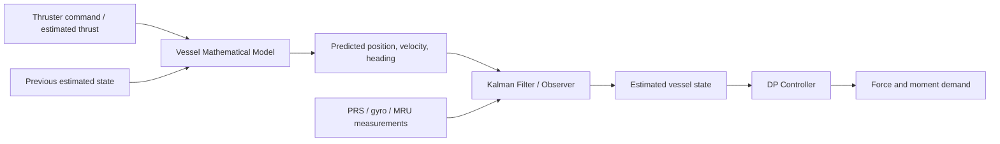

# Vessel Mathematical Model

## Definition

Vessel Mathematical Model은 DP 컴퓨터 안에서 선박의 움직임을 계산하기 위한 수학적 표현이다.
The vessel mathematical model is the mathematical representation used inside the DP computer to calculate vessel motion.

It describes how force and moment produce surge, sway, and yaw motion.
힘과 moment가 surge, sway, yaw 운동을 어떻게 만드는지 설명한다.

The model is not the ship itself.
모델은 선박 그 자체가 아니다.

It is a simplified internal copy of the ship, good enough to support estimation and control.
추정과 제어를 지원할 만큼 충분히 단순화된 내부 선박 복사본이다.

## Where It Is Used in the DP Loop



The model mainly acts in the prediction side of the observer.
모델은 주로 observer의 prediction 쪽에서 작용한다.

It tells the filter what the vessel should probably do before the next measurement arrives.
다음 측정값이 오기 전에 선박이 대략 어떻게 움직일지를 filter에 알려준다.

## 3-DOF DP Model

Most station-keeping DP control focuses on three horizontal degrees of freedom.
Station-keeping DP 제어는 보통 수평면 3자유도에 집중한다.

| DOF | Korean | English |
|---|---|---|
| Surge | 앞뒤 운동 | Forward/backward motion |
| Sway | 좌우 운동 | Sideways motion |
| Yaw | 선수방위 회전 | Heading rotation |

Heave, roll, and pitch are important for motion monitoring, but the DP controller mainly controls horizontal position and heading.
Heave, roll, pitch도 motion monitoring에는 중요하지만 DP controller가 주로 제어하는 것은 수평 위치와 heading이다.

## Simple Equation

The simplest idea is Newton's second law.
가장 단순한 생각은 뉴턴의 제2법칙이다.

```text
Mass × Acceleration
= Control force + Environmental force - Damping / resistance
```

For DP, this becomes a coupled horizontal-plane vessel model.
DP에서는 이것이 서로 연결된 수평면 선박 모델이 된다.

```text
M νdot + D ν = τthruster + τenvironment

ηdot = R(ψ) ν
```

| Symbol | Meaning |
|---|---|
| η | Position and heading, usually x, y, ψ |
| ν | Body-fixed velocity, usually surge, sway, yaw rate |
| M | Mass and inertia matrix, including added mass |
| D | Damping matrix |
| τthruster | Force and moment from thrusters |
| τenvironment | Wind, wave, current, and unmodelled disturbance |
| R(ψ) | Rotation between vessel body frame and earth/navigation frame |

This is simplified, but it shows the important idea: DP must translate between earth-fixed position error and vessel-fixed forces.
이 식은 단순화된 것이지만 중요한 생각을 보여준다. DP는 지구고정 좌표의 위치오차와 선체고정 좌표의 힘을 변환해야 한다.

## What the Model Contains

| Part | Korean | English |
|---|---|---|
| Rigid-body mass | 선체 질량과 yaw 관성 | Vessel mass and yaw inertia |
| Added mass | 물을 같이 가속시키는 효과 | Effect of accelerating surrounding water |
| Damping | 속도에 따른 저항과 감쇠 | Velocity-dependent resistance and damping |
| Thruster geometry | Thruster 위치와 방향 | Thruster position and direction |
| Wind coefficients | 바람에 대한 선체 힘 계수 | Vessel wind force coefficients |
| Current / low-frequency disturbance | 느리게 변하는 외력 | Slowly varying external disturbance |
| Coordinate transforms | 지구좌표와 선체좌표 변환 | Transformation between earth and body frames |

## Why the Model Is Needed

### 1. Sensor Noise Cannot Be Controlled Directly

PRS and sensors contain noise.
PRS와 센서에는 noise가 있다.

If the controller reacts directly to every noisy measurement, thrusters hunt.
Controller가 noisy measurement를 그대로 따라가면 thruster hunting이 생긴다.

The model gives the filter a physically reasonable prediction.
모델은 filter에게 물리적으로 그럴듯한 예측값을 제공한다.

### 2. PRS Can Drop Out

When position reference is lost briefly, the model allows limited prediction.
Position reference가 짧게 상실되면 모델은 제한적인 예측을 가능하게 한다.

This does not mean the vessel can safely operate without PRS for long.
이것은 선박이 PRS 없이 오래 안전하게 운항할 수 있다는 뜻이 아니다.

Uncertainty grows with time.
시간이 지날수록 불확실성은 커진다.

### 3. The Controller Needs Dynamics

A heavy vessel reacts slowly.
무거운 선박은 느리게 반응한다.

A vessel with strong damping behaves differently from a lightly damped vessel.
Damping이 큰 선박과 작은 선박은 다르게 움직인다.

The controller must know this behavior to avoid overshoot and oscillation.
Controller는 overshoot와 oscillation을 피하기 위해 이 거동을 알아야 한다.

### 4. Disturbance Estimation Needs a Baseline

If the model predicts one motion but the vessel drifts another way, the difference can be interpreted as environmental force or model error.
모델이 예측한 운동과 실제 drift가 다르면 그 차이는 환경 외력 또는 모델 오차로 해석될 수 있다.

This is one basis for current / low-frequency force estimation.
이것이 current 또는 low-frequency force 추정의 기반 중 하나다.

## Model Error

The model can be wrong.
모델은 틀릴 수 있다.

Common causes are:
대표 원인은 다음과 같다.

- Draft and loading condition changed.
- Draft와 loading condition이 변했다.
- Thruster performance degraded.
- Thruster 성능이 저하됐다.
- Hull fouling changed damping.
- Hull fouling으로 damping이 바뀌었다.
- Shallow water or bank effect appeared.
- Shallow water 또는 bank effect가 생겼다.
- A nearby offshore structure changed current/wave field.
- 가까운 offshore structure가 current/wave field를 바꿨다.
- Wind coefficients are not accurate for the actual heading and deck load.
- 실제 heading과 deck load에 대한 wind coefficient가 정확하지 않다.

## DPO Interpretation

DPO가 model 자체를 튜닝하지는 않더라도 model-based behavior를 읽을 수 있어야 한다.
Even if the DPO does not tune the model directly, the DPO should read model-based behavior.

Watch for:
다음을 봐야 한다.

- Estimated current or environmental force slowly building up after DP setup.
- DP setup 후 estimated current/environmental force가 서서히 형성되는지.
- Model position and measured position separating after PRS loss.
- PRS 상실 후 model position과 measured position이 벌어지는지.
- Large change in vessel response after loading/draft change.
- Loading/draft 변화 후 선박 응답이 크게 달라지는지.
- Controller demand increasing while actual vessel response remains weak.
- Controller demand는 증가하는데 실제 선박 응답이 약한지.

## Papers and References to Read

- Thor I. Fossen, *Guidance and Control of Ocean Vehicles*, 1994.
- Thor I. Fossen, *Handbook of Marine Craft Hydrodynamics and Motion Control*, 2nd ed., 2021.
- A. J. Sørensen, “A survey of dynamic positioning control systems,” *Annual Reviews in Control*, 2011.
- T. I. Fossen and J. P. Strand, “Passive nonlinear observer design for ships using Lyapunov methods: full-scale experiments with a supply vessel,” *Automatica*, 1999.
- Marine Systems Simulator (MSS), an open-source MATLAB/Simulink library for marine craft modelling and control.

## Related Notes

- [[Closed-loop Control]]
- [[Kalman Filter]]
- [[DP Controller]]
- [[Thrust Allocation]]
